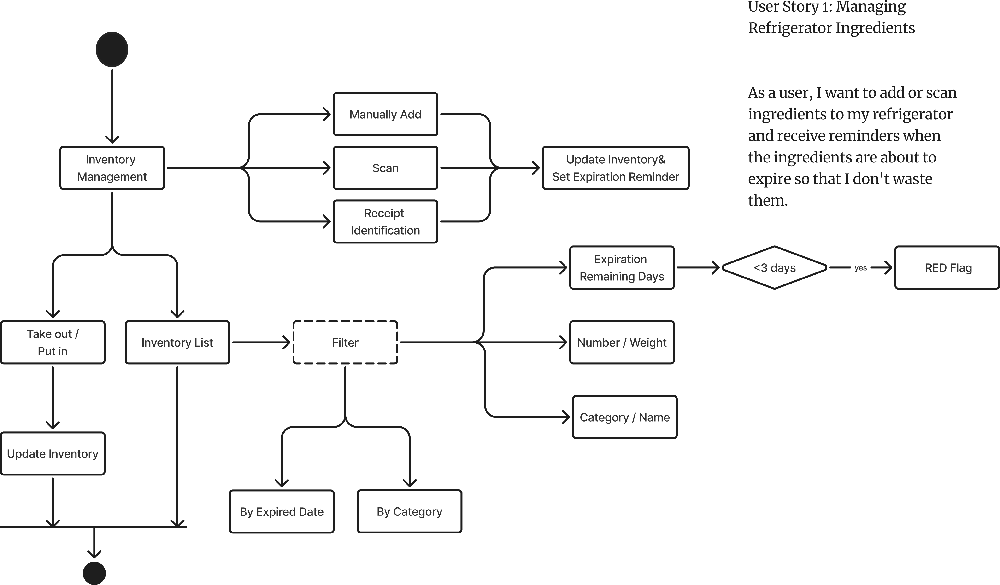
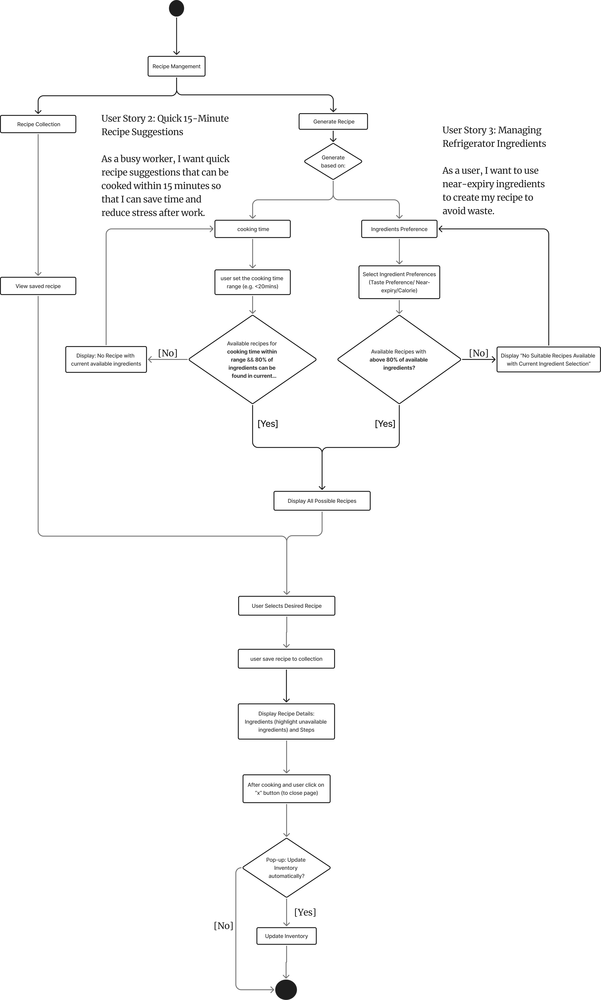

# Specification Phase Exercise

A little exercise to get started with the specification phase of the software development lifecycle. See the [instructions](instructions.md) for more detail.

## Team members

Yilin Wu (yw6501) - https://github.com/YilinWu1028  

Hanqi Gui (hg2542) - https://github.com/hanqigui  

Sina Liu (sl9608) - https://github.com/SinaL0123  

Jingyao Fu (jf4585) - https://github.com/Sophiaaa430

## Stakeholders
### **Stakeholder 1: Zoey**

**Age:** 21

**Background:** An international student living in a shared apartment. Busy with school during the week, usually cooks simple meals at home after class, and does bulk grocery shopping on weekends.

**User Type:** Time-constrained student who wants to eat healthily and stay on budget.

**Problems / Frustrations:**

* Often forgets what’s left in the fridge and ends up buying duplicates.
* Doesn’t know how to prioritize using soon-to-expire ingredients, leading to food waste.
* Suffers from “choice overload” and doesn’t have time to spend half an hour browsing recipe sites.

**Goals / Needs:**

* Generate recipes based on fridge inventory and expiry dates → **Waste-Reducing Recipes**
* Get reminders about soon-to-expire ingredients → **Expiry Alerts**
* Quickly find 15-minute easy recipes for late, exhausting days → **Quick Meals**

---

### **Stakeholder 2: Sitong**

**Age:** 28

**Background:** A new mother taking care of a baby and children at home while her husband works. Needs to balance childcare and housework, leaving very limited time and energy.

**User Type:** Users who need efficient meal planning and grocery management.

**Problems / Frustrations:**

* Different family members have different dietary needs (postpartum nutrition vs. husband’s weight loss vs. baby’s complementary food), which are hard to balance.
* Every time I go to the supermarket, I need to buy a lot of food and need a simple operation to record the food inventory.

**Goals / Needs:**

* Get recipe recommendations for different family members’ dietary needs (low oil, low salt, balanced nutrition, postpartum care, weight loss, baby meals) → **Personalized Recipes**
* There are multiple ways to enter ingredients: manual, scanning, and receipt → **Convenient System**

---

### **Stakeholder 3: Jason**

**Age:** 29

**Background:** A single professional living alone. Busy with work, has limited cooking skills, but is highly focused on fitness and nutrition (high-protein, low-fat). Limited kitchen tools and condiments.

**User Type:** Single fitness-focused users who care about diet structure but lack cooking experience.

**Problems / Frustrations:**

* Lacks cooking skills and gives up when recipes look too complicated.
* Needs to control protein and calorie intake precisely for fitness but doesn’t know how to calculate it.
* Lacks variety and inspiration; ends up eating chicken breast and broccoli all the time.

**Goals / Needs:**

* Quickly generate high-protein, low-fat menus suitable for fitness (e.g., chicken breast, fish, vegetables) → **Personalized Fitness Recipes**
* Access simple, easy-to-cook recipes (15–20 minutes, no complex tools required).
* Track daily nutritional intake to ensure protein and calorie goals are met → **Nutrition Tracking**

## Product Vision Statement

Our app helps busy students, parents, and professionals manage their fridge inventory and reduce food waste by tracking ingredients and expiry dates, while generating personalized recipes that match dietary needs, cooking skills, and available time. By integrating expiry alerts, nutrition tracking, and multiple ways to record ingredients, the app makes meal planning and grocery shopping simpler, healthier, and tailored to each user’s lifestyle.

## User Requirements

- As a busy worker, I want quick 15-minute recipe suggestions so that I can cook after work without stress.  

- As a health-conscious user, I want to see nutritional information for each meal so that I can track my protein intake.  

- As a user, I want reminders when food is about to expire so that I can avoid waste.  

- As a user, I want recipes that prioritize using my existing inventory so that I buy fewer new items.  

- As a user, I want to record what I’ve cooked so that my inventory updates automatically.  

- As a beginner cook, I want simple step-by-step recipes so that I can follow easily.  

- As a vegetarian, I want the app only to suggest plant-based meals so that I don’t see recipes I can’t use.  

- As a user with food allergies, I want to exclude certain ingredients so that my meals are safe to eat.  

- As a fitness enthusiast, I want the app to generate high-protein weekly recipes so that I can reach my training goals.

- As a user, I want to filter recipes by cooking time so that I can choose meals that fit my schedule.

## Activity Diagrams

### UML 1

### UML 2

## Clickable Prototype

- https://www.figma.com/proto/4vb1tsHDFKE5QMRTwCT8oL/SmartBite---swe-project1?node-id=172-251&t=b4Gm980JKCOh5boZ-0&scaling=scale-down&content-scaling=fixed&page-id=0%3A1&starting-point-node-id=172%3A251&show-proto-sidebar=1
